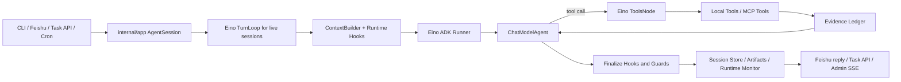
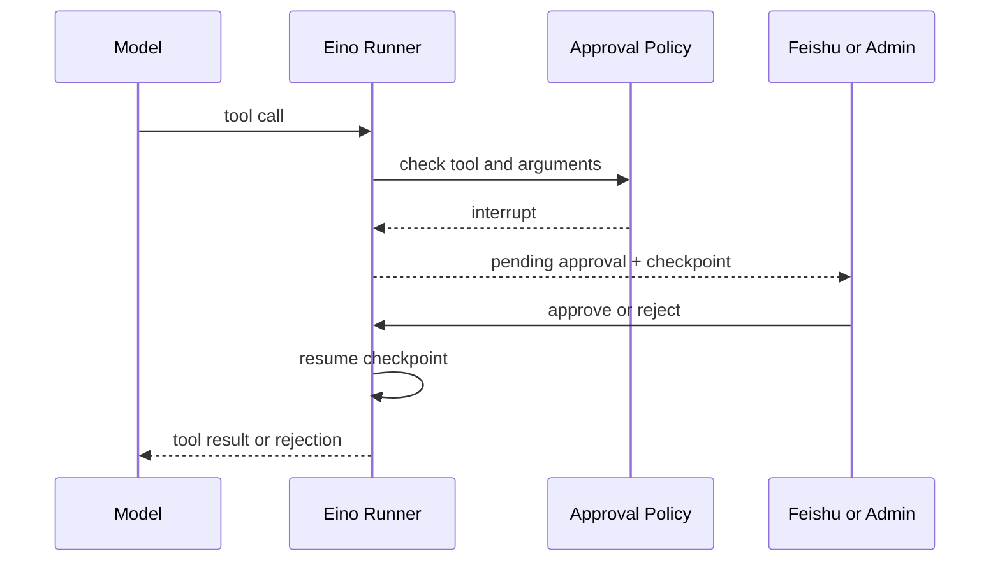

# 系统架构

Ternura 是一个以 Eino ADK 为执行内核、以 `internal/app` 为应用装配层的通用 Agent。CLI、飞书、HTTP Task 和 cron 只是不同入口，最终共享同一套 session、上下文、工具、审批和持久化生命周期。

## 包边界

```text
.
├── agent/                 # Agent runtime、Eino ADK、ContextBuilder、Skill、Hook、审批
├── agents/                # 声明式委派 Agent 定义
├── cmd/ternura/           # 薄可执行入口
├── config/                # Provider 和模型配置
├── docs/                  # 面向人的项目文档
├── internal/app/          # 应用装配、AgentSession、Channel、memory、Task API、管理页
│   └── admin/             # 嵌入二进制的管理页静态资源
├── internal/cron/         # schedule、持久化、触发和运行历史
├── internal/feishu/       # 飞书事件、消息、卡片、Reaction 和 OpenAPI
├── internal/mcpruntime/   # MCP 配置和远端 Tool 装配
├── skills/                # OpenClaw / AgentSkills 风格的运行时 Skill
└── tool/                  # Eino 原生 Tool 的本地实现
```

边界原则：

- `agent/` 只关心模型、消息、工具和一次 Agent run。
- `internal/app/` 负责把外部输入映射到 session 和 run，并组合各基础设施。
- `tool/` 描述模型可调用的能力，不拥有 cron、飞书或 session 的生命周期。
- `internal/cron/` 和 `internal/feishu/` 分别拥有自己的领域状态和外部协议。
- `cmd/ternura/` 不承载业务逻辑。

## 主流程



模型的一次 `Generate` 只完成一次模型交互；ReAct 的多轮“模型 -> 工具 -> 模型”由 Eino ADK Runner 编排。Ternura 负责提供 ChatModel、Tools、运行上下文和扩展 Hook，不再手写工具循环。

普通飞书消息和 HTTP Task 按 session 进入 Eino `TurnLoop`。同一 session 在运行中收到新消息时，框架会在 `AfterChatModel` 或 `AfterToolCalls` 安全点抢占当前 turn；短时间连续补充只执行最新一条。审批恢复、cron 触发和确定性本地操作仍复用 AgentSession 生命周期，但不会伪装成新的模型 turn。

## AgentSession 生命周期

`internal/app.AgentSession` 统一管理不同入口的运行：

1. 把外部输入整理为 `agentSessionRunRequest` 或 live session 的 `sessionTurnRequest`。
2. 区分展示给用户的 `DisplayMessage` 和送入模型的 `RuntimePrompt`。
3. 创建 `run_id`，写入 session store，并注册 Runtime Monitor。
4. 恢复对应 session 的消息和记忆。
5. 调用 Agent 或从 checkpoint 恢复审批运行。
6. 写入最终状态、回答、trace、evidence、metrics 和 Artifact。
7. 向飞书、Task API 或管理页暴露同一份结果。

Feishu、cron 和异步 Task 不各自实现 start/run/finish，从而避免状态、错误和持久化行为分叉。

### 运行中纠偏

运行中的新消息不是简单排队到旧回答之后：

1. 新输入写入当前 session 的 `TurnLoop` buffer。
2. Eino 请求当前 ChatModelAgent 在最近安全点取消。
3. 已被抢占的 run 记录为 `cancelled`，不进入对话历史。
4. 新 turn 的 `RuntimePrompt` 包含原始请求和按时间排序的补充，最后一条优先。
5. 持久化 run 仍保留用户实际输入作为 `UserMessage`，而模型历史保存完整修正后的 user/assistant Turn。

连续到达的补充会合并为最新要求；尚未开始模型执行的旧补充标记为被替代，不消耗模型调用。

## SkillRegistry

Agent 创建时先装配 `SkillRegistry`。Skill 是以下能力的组合：

- 模型运行时说明。
- 一组 Eino Tool。
- 一组生命周期 Hook。

内置 Skill 按 workspace、memory、schedule、web、grounding 等能力拆分。Registry 负责工具去重、Hook 合并，并通过 `Enabled Skills` runtime context 告诉模型当前能力。

外部 `SKILL.md` 只提供模型可读说明，不直接注册 Go 工具。为了控制 prompt，默认只注入名称、描述、来源和文件路径；模型决定使用时再通过 `read` 读取全文。

### Skill 扫描顺序

1. `<workspace>/skills`
2. `<workspace>/.agents/skills`
3. `~/.agents/skills`
4. OpenClaw workspace 的 `skills`
5. `~/.openclaw/skills`
6. `~/.skillhub/skills`
7. `TERNURA_SKILL_DIRS`

支持 `metadata.openclaw.platforms`、`requires.env`、`requires.bins`、`requires.anyBins` 和 `alwaysInclude`。可以用 `TERNURA_SKILLS` 设置允许列表，或用 `TERNURA_SKILLS_DISABLED` 禁用指定 Skill。

## Hook 生命周期

Agent runtime 提供以下扩展点：

| Hook | 用途 |
| --- | --- |
| `BeforeRun` | 初始化预算、运行上下文和审计状态 |
| `AfterUserMessage` | 检索、分类或预处理用户输入 |
| `BeforeModelCall` | 构建上下文、注入 runtime block、调整工具 |
| `AfterModelResponse` | 记录模型响应和工具调用计划 |
| `BeforeToolCall` | 权限、审批、参数检查和进度事件 |
| `AfterToolCall` | 审计、截断、脱敏和结果记录 |
| `FinalizeRun` | 状态归因、输出清洗和最终 trace |
| `AfterRun` | 持久化记忆、产物和后台维护 |

runtime context 只参与当前模型调用，不写入持久化对话历史。为了兼容 OpenAI-compatible Provider，它会合并进主 system prompt，而不是追加第二条 system message。

Eino callbacks 用于观察框架节点和流式调用；Ternura Hook 用于表达项目级策略。两者职责不同，可以同时工作。

## ContextBuilder

ContextBuilder 保持完整 user/assistant/tool 语义链，并按以下顺序控制上下文：

1. `tool_result_budget`：把超预算的大工具输出写入 `.task_outputs/tool-results/`，上下文只保留路径和 preview。
2. `snip_compact`：消息过多时裁剪中段，保持 assistant tool call 与 tool result 成组。
3. `micro_compact`：把较旧工具结果替换为占位，保留最近结果。
4. `compact_history`：仍超过阈值时写 transcript，并调用模型生成 `[Compacted]` 摘要。
5. 最终预算裁剪：始终保留最新用户输入，并按 tool-call group 从尾部保留。

Provider 返回 `prompt_too_long` 或同类错误时，会触发 reactive compact 并重试一次。摘要失败则回退到确定性裁剪，避免上下文模块阻断整次运行。

守护进程重启时只恢复清洗后完整的 `user -> assistant` 对。孤立消息、空回答、被拦截回答和未完成 run 会整轮跳过，最多保留最近 12 个完整 Turn，不再向模型注入连续的 user-only 历史。

## Evidence Ledger

Tool middleware 在真实工具返回后生成结构化证据记录，每条包含 `E#`、工具名、类型、状态、来源 URL、摘要、采集时间和内容 SHA-256：

- `web_fetch` 成功读取的页面是可引用 `source`。
- `web_search` 结果只是不可引用的 `discovery`，必须继续 fetch 才能支撑事实。
- 文件读取、命令和 MCP 返回记录为 `observation`。
- 写入、编辑、记忆和 cron 等副作用记录为 `action`。
- 失败、拒绝和不可用页面同样保留，但标记为不可引用。

每次后续模型调用都会收到当前 run 的 Evidence Ledger runtime block，并使用 `[E1]` 形式关联结论。账本不调用第二个 verifier 模型，也不替模型做事实判断；飞书折叠面板、Task API、run JSON 和管理页读取的是同一份确定性记录。

## 记忆

记忆通过 Hook 接入，而不是直接写进 Agent loop：

- `BeforeModelCall`：先判断当前请求是否值得召回，再提取 keywords/search query。
- 候选检索：从长期记忆、当前 session 轮次和工具摘要中按 query 匹配少量内容。
- AI summarizer：只在候选强相关时压缩为紧凑的 `Active Memory` block。
- `AfterRun`：成功后追加当前轮到短期记忆。
- `remember` / `forget_memory`：显式维护长期记忆。

如果 summarizer 判断无强相关内容，就不向主模型注入 Active Memory，也不向飞书展示记忆召回过程。管理页只展示记忆数量，不读取记忆正文。

## Tool

本地工具实现 `einotool.InvokableTool`：

```go
type Tool interface {
    einotool.InvokableTool
    ToolName() AgentTool
}
```

当前工具包括：

- 工作区：`read`、`write`、`edit`、`bash`
- 任务状态：`update_todos`、`compact`
- 记忆：`remember`、`forget_memory`
- 调度：`cron`
- 网络：`web_search`、`web_fetch`
- 委派：`delegate_agent`
- 外部扩展：动态加载的 MCP Tools

Tool middleware 用于框架级横切能力，例如审批和 trace；具体工具仍只负责参数 schema 和执行。

## 审批与 checkpoint

高风险工具由 Eino `StatefulInterrupt` 暂停，checkpoint 落盘后等待人工决定：



恢复运行不会重复执行 checkpoint 之前已经完成的模型和工具步骤。

## 状态归因与输出保护

Harness 不做统一前置意图路由，工具选择主要由模型、Skill 和 tool schema 决定。项目只在真实状态边界增加保护：

- 拦截 MiniMax 风格的伪工具调用文本。
- 校验命令、安装、文件修改和记忆变更等副作用是否有本轮工具证据。
- 校验定时任务 ID 是否来自真实 cron store 或成功工具结果。
- 清洗可能触发飞书审计的过程文本。

普通建议和外部事实判断不再统一经过第二个 verifier 模型，避免过度拦截。

## Runtime Monitor

Runtime Monitor 是内存中的轻量运行视图，不替代 session store：

- AgentSession 创建和结束运行时注册 lifecycle。
- 模型、工具和 TurnLoop 更新 `thinking`、`tool`、`correcting` 和 `finishing` 阶段。
- `/api/runtime` 返回当前快照。
- `/api/events` 通过 SSE 发布开始、更新和结束事件。
- 管理页收到事件后刷新持久化 Task 详情。

事件只包含运行摘要，不广播完整 prompt、模型上下文或工具结果。

## 运行结果

每个 run 的核心结构：

- `content`：去掉 think 后的最终回答。
- `trace`：思考阶段和工具调用记录。
- `evidence`：结构化 Tool 证据账本。
- `raw_content`：模型最后一次原始输出。
- `model_input`：用于诊断的模型输入快照。
- `metrics`：模型调用、工具调用和 Token 统计。
- `artifacts`：可独立消费的运行产物。
- `checkpoint_id` / `pending_approval`：可恢复审批状态。

持久化位置和运维接口见 [运行与运维](operations.md)。
